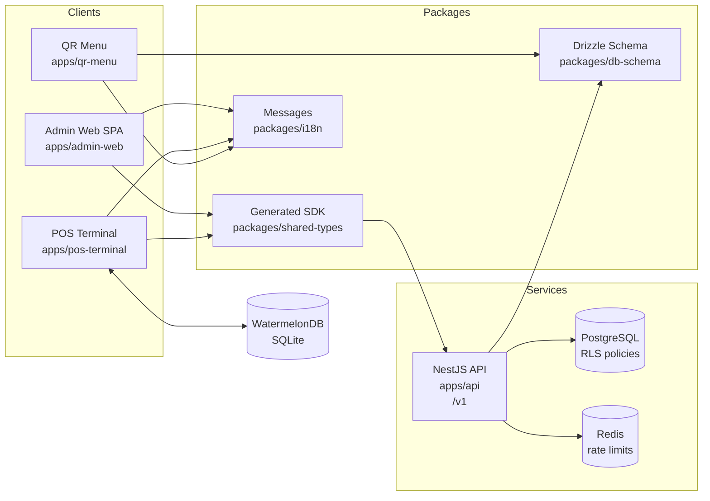

# Phase 0 Architecture

## Overview

Phase 0 establishes the foundation for the Mizan restaurant POS and management platform while keeping the existing Quickarte QR menu/order/loyalty application in the same repository. It does not implement feature modules such as order taking, menu management, KDS, stock deduction, reporting, CMI payments, kiosks, or delivery aggregator integrations.

The new foundation adds a NestJS API, generated OpenAPI SDK, Vite admin shell, Expo POS shell, shared i18n package, shared Drizzle schema package, row-level security for new API-owned tenanted tables, JWT auth, permission checks, refresh-token rotation, and the first offline sync skeleton.

## Monorepo Structure

```text
apps/
  qr-menu/        Existing Quickarte Next.js app; still owns legacy UX and Phase 0 migration execution.
  api/            NestJS REST API under /v1 with OpenAPI, auth, RLS, sync, and audit foundations.
  admin-web/      Vite React SPA for owner/manager web administration.
  pos-terminal/   Expo React Native POS terminal shell with WatermelonDB and sync skeleton.

packages/
  config/         Shared TypeScript, ESLint flat config, and Prettier config.
  db-schema/      Drizzle tables, migrations, migration metadata, and seed scripts.
  i18n/           Shared FR/AR/Darija message files and locale helpers.
  shared-types/   OpenAPI-generated API types and typed client helper.
  ui/             Empty shared UI package reserved for later extraction.
```

Migration ownership is intentionally narrow: Quickarte/root `db:*` scripts run migrations in Phase 0. The API consumes the schema but does not independently migrate the database.

## Service Topology



## Multi-Tenancy Model

`business_id` is the tenant key everywhere for new foundation code. API requests carry tenant context through JWT claims after M5, with `X-Tenant-Id` retained only as a non-production development fallback.

The API database service exposes `withTenant(businessId, callback)`. This helper opens a transaction, validates the UUID, runs `SET LOCAL app.current_business_id = ...`, and yields a transaction-scoped Drizzle client. The `SET LOCAL` rule is mandatory because PostgreSQL pool connections are reused.

Strict RLS is enabled on new API-owned tenanted tables:

- `audit_log`
- `roles`
- `role_permissions`
- `permission_versions`
- `api_refresh_tokens`

RLS is deferred for Quickarte-shared tables until Quickarte DB access is refactored to use tenant-scoped transactions. That rollout is documented in `docs/phase-0/RLS_ROLLOUT_PLAN.md`.

Subdomain routing is documented in `docs/phase-0/SUBDOMAIN_ROUTING.md`. Admin web resolves tenant slug from `{slug}.${TENANT_ROOT_DOMAIN}`. The API receives tenant context from JWT claims and can later resolve subdomain-derived slugs through the same contract.

## Auth Flow

Owner/manager web login uses `POST /v1/auth/owner/login` with email, password, and business slug. Staff POS login uses `POST /v1/auth/staff/pin-login` with business id and PIN. Both flows issue:

- 15-minute JWT access token
- 30-day refresh token
- `business_id`
- `role_id`
- `permissions_version`
- `is_platform_admin: false`

Refresh tokens are opaque values prefixed with the tenant id, stored server-side as HMAC-SHA256 hashes, and rotated on every successful refresh through `POST /v1/auth/refresh`.

Authorization uses:

- `@RequirePermission(...)` metadata on endpoints
- `PermissionsGuard` for role permission checks
- `permission_versions` to reject stale JWTs after permission changes
- `ManagerOverrideGuard` for endpoints that need manager PIN approval

Pattern A super-admin is selected but not implemented. The decision and required invariants are in `docs/phase-0/SUPER_ADMIN_DECISION.md`.

## Sync Flow

The POS terminal uses WatermelonDB on SQLite and a sync skeleton built around WatermelonDB's `synchronize()` helper.

Pull flow:

1. POS calls `GET /v1/sync/pull?since=<timestamp>`.
2. API reads the JWT tenant context.
3. API returns WatermelonDB-shaped changes for `businesses` and `staff_members`.
4. POS applies changes locally and records sync metadata.

Push flow:

1. POS gathers local changes through WatermelonDB/outbox.
2. POS calls `POST /v1/sync/push`.
3. API accepts only `audit_log` writes in Phase 0.
4. Server validates `business_id`, writes inside `withTenant()`, and returns success.

Conflict policy is server-timestamp-wins. The helper exists in `apps/pos-terminal/src/sync/conflict.ts`; future feature modules add their own synced tables without changing the protocol shape.

## i18n Flow

Translation files live in `packages/i18n/messages`:

- `fr.json` is the default locale.
- `ar.json` is the Arabic RTL slot.
- `darija.json` reserves the Darija locale.

Quickarte consumes the shared messages through its existing next-intl setup. Admin web and POS terminal consume the same messages with i18next/react-i18next. Arabic flips direction in admin web by setting `html dir="rtl"` and in POS terminal through React Native `I18nManager`.

The shared format target is the ICU MessageFormat subset supported by both next-intl and i18next.
