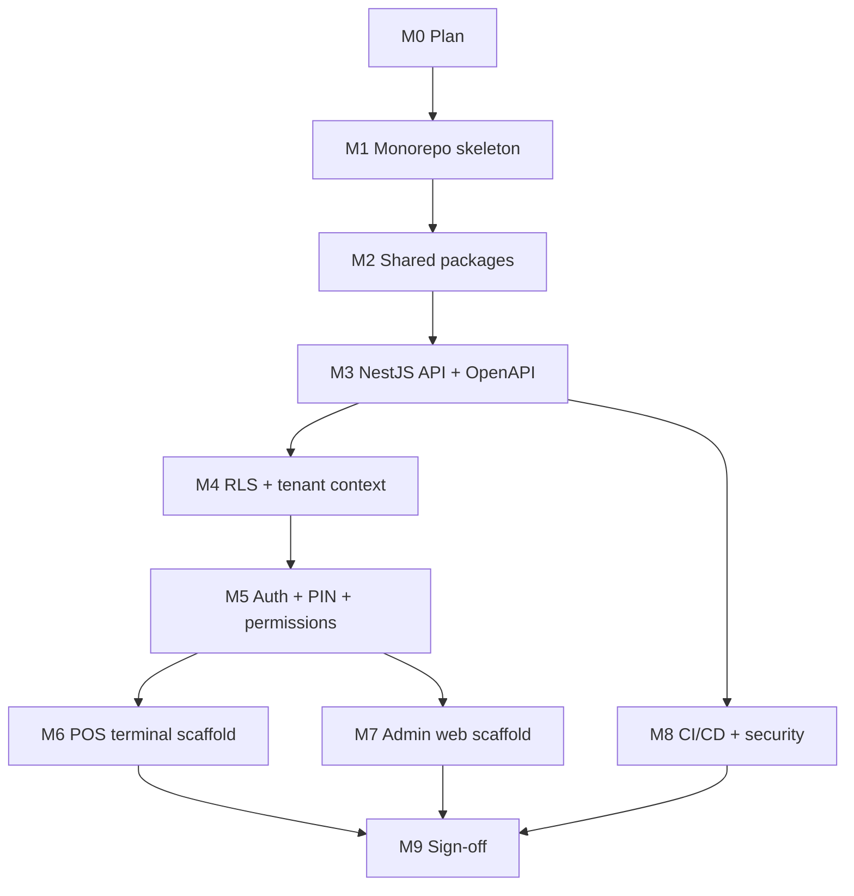

# Phase 0 Foundation Implementation Plan

> Branch: `phase-0-foundation`
>
> Status: M0 planning only. Do not start M1 until the project manager explicitly says `go to M1`.

## Goal

Build a new API-first, offline-capable, multi-tenant POS foundation inside the existing Quickarte repository while keeping the current Quickarte QR/order/loyalty app working at every milestone.

## Current Baseline

- Current repo: `https://github.com/Darkhouse13/quickarte`
- Branch created for Phase 0: `phase-0-foundation`
- Existing app: single Next.js Quickarte app at repo root.
- Audit verdict: `SALVAGEABLE WITH REFACTOR`.
- Accepted direction: keep Quickarte, restart the POS foundation alongside it in the same monorepo.
- Existing verified baseline from audit:
  - `npm.cmd ci` succeeds.
  - `npm.cmd test` passes: 356 tests, 348 pass, 8 skipped.
  - `npm.cmd run build` succeeds.
  - `npm.cmd run typecheck` succeeds.
  - `npm.cmd run lint` is not usable because `next lint` prompts for ESLint setup and is deprecated.
  - `npm.cmd audit` reports 9 vulnerabilities: 6 moderate, 3 high.

## Source Documents Read

- `README.md`
- `docs/00-PRODUCT-BRIEF.md`
- `docs/01-PRODUCT-STRATEGY.md`
- `docs/02-TECHNICAL-DIRECTION.md`
- `docs/03-DESIGN-SYSTEM.md`
- `docs/04-PRICING-AND-ENTITLEMENTS.md`
- `docs/05-DEPLOYMENT.md`
- `docs/audit-2026-04-24.md`
- `docs/phase-0/MVP_Feature_Spec_v1.md`
- `docs/phase-0/SPEC_AMENDMENTS.md`
- Current Phase 0 prompt and accepted audit result from the project manager.

## Canonical Feature Spec

`docs/phase-0/MVP_Feature_Spec_v1.md` is present and has been read in full.

The spec is canonical for feature and module scope, except where it conflicts with locked Phase 0 decisions. Those conflicts are recorded in `docs/phase-0/SPEC_AMENDMENTS.md`, which is authoritative whenever the spec and locked decisions disagree.

Impact:

- M1 remains a mechanical restructure that preserves Quickarte behavior.
- M2-M9 must follow the spec plus `SPEC_AMENDMENTS.md`.
- Any new contradiction found during M1-M9 must be appended to `SPEC_AMENDMENTS.md` before implementation relies on it.

## Locked Architecture

Locked decisions from the PM prompt override existing Quickarte docs where they conflict.

| Area | Phase 0 direction |
|---|---|
| Repo | Monorepo using pnpm workspaces and Turborepo |
| Existing Quickarte app | Move to `apps/qr-menu`; keep behavior and tests green |
| Backend API | NestJS TypeScript app in `apps/api` |
| API contract | OpenAPI 3, versioned under `/v1` |
| Admin web | React + TypeScript + Vite SPA in `apps/admin-web` |
| POS terminal | Expo React Native app in `apps/pos-terminal` |
| Database | PostgreSQL |
| ORM/schema | Drizzle, moved to `packages/db-schema` |
| Tenant key | `business_id` |
| Tenant isolation | PostgreSQL RLS + subdomain routing |
| Auth | Keep Better Auth for Quickarte; add/verify JWT issuance for API/mobile |
| Offline POS | WatermelonDB on SQLite |
| Sync | Local outbox, chronological flush, server-timestamp-wins |
| Real-time | Socket.io |
| Cache/queue | Redis + BullMQ |
| SDK | Generated TypeScript SDK in `packages/shared-types` |
| i18n | Shared translations in `packages/i18n`; next-intl for Quickarte; i18next for admin/POS |
| Hardware | Extend existing printer abstraction: `escpos_lan`, `escpos_usb`, `webprint` |
| Deploy | Coolify on Hetzner Germany, cloud-agnostic containers |
| CI | GitHub Actions |
| Payments | No Stripe work in Phase 0; CMI later |

## Proposed Monorepo Structure

Target after M2/M3:

```text
quickarte/
  apps/
    qr-menu/              # Existing Quickarte Next.js app, moved mostly intact
    api/                  # New NestJS API, versioned /v1
    admin-web/            # New Vite React SPA for back-office/admin
    pos-terminal/         # New Expo React Native POS terminal
  packages/
    config/               # Shared tsconfig, ESLint, Prettier
    db-schema/            # Drizzle schema, migrations, DB helpers shared by apps
    i18n/                 # FR, AR, Darija placeholder, locale helpers
    shared-types/         # Generated OpenAPI SDK and shared TS API types
    ui/                   # Empty shell in Phase 0; no shared UI extraction yet
  docs/
    phase-0/
      PLAN.md
      README.md           # Created in M9
  docker-compose.yml      # Root dev services: Postgres, Redis, app profiles
  package.json
  pnpm-workspace.yaml
  turbo.json
```

Boundary rules:

- `apps/qr-menu` owns current Quickarte domain code during Phase 0.
- `packages/db-schema` owns database schema and migrations once M2 lands.
- `apps/api` is the only app that needs to be API-first in Phase 0.
- `apps/admin-web` and `apps/pos-terminal` must consume the generated SDK instead of handwritten `fetch`.
- Do not extract Quickarte KDS, printing, loyalty, POS reconciliation, close-of-day, or permissions domain logic into shared packages during Phase 0. That extraction belongs to later module work.

## Migration Path for Quickarte into `apps/qr-menu`

M1 must be a behavior-preserving move.

1. Confirm clean branch state.
2. Create `apps/qr-menu`.
3. Move existing app files with `git mv` where possible:
   - `app/`
   - `components/`
   - `docs/` stays at root, except app-specific docs only if required later.
   - `i18n/`
   - `lib/`
   - `messages/`
   - `public/`
   - `scripts/`
   - root Quickarte configs: `next.config.ts`, `tailwind.config.ts`, `postcss.config.mjs`, `tsconfig.json`, `drizzle.config.ts`, Sentry configs, `instrumentation.ts`, `middleware.ts`, `.env.example`
   - root Quickarte `package.json` and `package-lock.json` contents become `apps/qr-menu/package.json`; lock strategy changes to pnpm at root.
4. Keep root docs at root unless a file is app-runtime-specific.
5. Update path aliases:
   - Preserve `@/*` inside `apps/qr-menu` by setting `baseUrl`/`paths` relative to the app.
   - Do not rewrite imports to package aliases until M2.
6. Update commands:
   - Root `pnpm test` delegates to Turbo and runs `apps/qr-menu` tests.
   - Root `pnpm build` delegates to Turbo and builds Quickarte.
   - Root `pnpm dev` starts Quickarte only in M1.
7. Update deployment:
   - Replace single-app Dockerfile with a Quickarte-targeted build context or root Dockerfile using `pnpm --filter @quickarte/qr-menu build`.
   - Document the Coolify build command and app directory.
8. Verify:
   - `pnpm install`
   - `pnpm --filter @quickarte/qr-menu test`
   - `pnpm test`
   - `pnpm --filter @quickarte/qr-menu build`
   - `pnpm build`
   - `pnpm --filter @quickarte/qr-menu dev`
9. Commit M1 only after all acceptance commands are green or any remaining issue is explicitly approved by PM.

## Milestone Breakdown

### M1 - Monorepo Skeleton

Objective: Move Quickarte into a pnpm/Turbo monorepo without changing behavior.

Tasks:

| Task | Complexity | Notes |
|---|---:|---|
| Create root workspace files: `package.json`, `pnpm-workspace.yaml`, `turbo.json` | M | Root scripts delegate to Turbo. |
| Move Quickarte app into `apps/qr-menu` with `git mv` | L | Highest regression risk due path/config moves. |
| Convert npm lock to pnpm lock | M | Remove `package-lock.json` only after `pnpm-lock.yaml` works. |
| Preserve Quickarte `@/*` imports | M | App-local TS path config first; no package extraction yet. |
| Update Next/Sentry/Tailwind/PostCSS config paths | M | Build must match pre-move behavior. |
| Verify Sentry configs move correctly | M | `sentry.*.config.ts` must still load from `apps/qr-menu`. |
| Verify environment loading from new app path | M | `.env`, `.env.local`, and env validation must still load correctly. |
| Verify runtime entry files after move | M | `instrumentation.ts` and `middleware.ts` must still run correctly. |
| Update Docker/Coolify build path for Quickarte | M | Keep one deployable Quickarte service. |
| Verify install/test/build/dev | M | Must keep 348 passing tests green. |
| Commit M1 | S | Commit only monorepo skeleton changes. |

Acceptance:

- Quickarte works identically from `apps/qr-menu`.
- Root commands work through pnpm/Turbo.
- No new app behavior.

### M2 - Shared Packages

Objective: Create workspace packages and move low-risk shared foundations.

Tasks:

| Task | Complexity | Notes |
|---|---:|---|
| Create `packages/config` | M | Shared TS config, ESLint flat config, Prettier config. |
| Replace deprecated `next lint` with ESLint CLI | M | Should resolve audit lint blocker. |
| Create `packages/i18n` | M | Move existing `messages/fr.json` and `messages/ar.json`; add Darija placeholder. |
| Wire Quickarte next-intl to load from `packages/i18n` | M | Keep Quickarte route behavior unchanged. |
| Create `packages/db-schema` | L | Move Drizzle schema/migrations carefully. |
| Update Quickarte imports from `@/lib/db/schema` to package import | L | Minimize churn; no domain extraction. |
| Create `packages/shared-types` | S | Empty buildable package for generated SDK later. |
| Create `packages/ui` | S | Empty package shell only. |
| Verify Quickarte tests/build/lint/typecheck | M | Lint should become non-interactive. |
| Commit M2 | S | Shared package extraction only. |

Acceptance:

- Quickarte uses the packages.
- Tests/build/typecheck/lint pass.
- No feature behavior changes.

### M3 - NestJS API Foundation

Objective: Add the new API app and first OpenAPI-generated SDK.

Tasks:

| Task | Complexity | Notes |
|---|---:|---|
| Scaffold `apps/api` with NestJS | M | TypeScript, workspace local package names. |
| Add `/v1` global version prefix | S | All controllers under `/v1`. |
| Add `GET /v1/health` | S | Check app and DB connectivity. |
| Add Swagger UI at `/v1/docs` | M | OpenAPI JSON must be generated in CI. |
| Connect API to Postgres via `packages/db-schema` | M | No duplicated schema. |
| Add structured JSON logging | M | Prefer Pino unless Nest compatibility blocks it. |
| Add consistent error response shape | M | Problem-details-like JSON with request id. |
| Add `audit_log` table migration | M | Fields from prompt: action, actor, business, entity, before/after, IP, UA, timestamp. |
| Add audit log service/middleware skeleton | M | Infrastructure only; no endpoint wiring yet. |
| Generate TS SDK into `packages/shared-types` | L | Use OpenAPI generator compatible with pnpm/Turbo. |
| Verify API health/docs/SDK import | M | Quickarte must still pass. |
| Commit M3 | S | API foundation only. |

Acceptance:

- `GET /v1/health` returns 200.
- `/v1/docs` loads.
- SDK import works from another workspace.
- Audit log table can be migrated.
- Quickarte remains green.

### M4 - Multi-Tenancy and RLS

Objective: Enforce tenant isolation at the database layer and prove it.

Tasks:

| Task | Complexity | Notes |
|---|---:|---|
| Define API tenant context model | M | `business_id` from JWT claims or subdomain. |
| Add request middleware/guard for tenant context | M | No silent fallback to unscoped queries. |
| Add DB transaction helper that sets `SET LOCAL app.current_business_id` | L | Must work with pooled Postgres connections. |
| Enable RLS on new tenanted API tables | L | Default deny. |
| Add RLS policy pattern using `current_setting('app.current_business_id', true)` | L | Avoid errors when unset; default deny. |
| Add stub tenanted resource `GET /v1/businesses/me` | M | Demonstrates subdomain -> context -> RLS query. |
| Write cross-tenant integration test | L | Must prove forged IDs cannot cross tenant boundary. |
| Document subdomain routing strategy | M | DNS wildcard, local dev, Coolify, production. |
| Surface super-admin model for PM decision | M | Must be signed off before implementation path expands. |
| Commit M4 | S | Tenant/RLS foundation only. |

Acceptance:

- Tenant A cannot read tenant B through API or forged ID.
- RLS test proves DB-level enforcement.

### M5 - Auth Foundation

Objective: Establish API/mobile auth, staff PIN login, permissions, and manager override pattern.

Tasks:

| Task | Complexity | Notes |
|---|---:|---|
| Verify Better Auth JWT support | M | Must not silently replace Better Auth. |
| If supported, add JWT issuance flow | L | Claims include `sub`, `business_id`, `role`, permissions version. |
| If unsupported, write decision memo and stop for PM sign-off | M | Options: Better Auth plugin, custom JWT layer, Auth.js swap. |
| Add permission tables | L | Owner, Manager, Cashier, Waiter, Kitchen, Custom; about 40 actions. |
| Add permission seed/migration | M | Deterministic default matrix. |
| Add PIN credential model | M | Store hashed PIN, never plain text. |
| Add Redis-backed PIN rate limiting | M | Lock after 5 failed attempts. |
| Add staff PIN login endpoint | L | Issues JWT when allowed. |
| Add protected sample endpoint | M | Proves JWT + permission guard. |
| Add manager override service/pattern | L | Override events log to `audit_log`. |
| Confirm password/PIN hashing strength | M | Surface if Better Auth is weaker than bcrypt/argon2/scrypt. |
| Commit M5 | S | Auth foundation only. |

Acceptance:

- Staff PIN login issues JWT.
- JWT carries `business_id` and `role`.
- Protected sample endpoint enforces permissions.
- Manager override logs to audit log.

### M6 - POS Terminal Scaffold

Objective: Add Expo POS app with offline database and sync skeleton.

Tasks:

| Task | Complexity | Notes |
|---|---:|---|
| Scaffold `apps/pos-terminal` Expo app | M | Keep starter minimal. |
| Add i18next wired to `packages/i18n` | M | FR default, AR RTL test path, Darija reserved. |
| Add login shell using PIN auth from M5 | M | No feature UI beyond shell. |
| Add WatermelonDB and SQLite setup | L | Schema subset only: business profile, staff/session, sync metadata. |
| Add local outbox table/model | L | Chronological flush order. |
| Add sync engine skeleton | L | Pull, push, 30s background, manual sync. |
| Add server-timestamp-wins conflict policy helper | M | No feature-specific conflicts yet. |
| Add offline indicator | M | Green/yellow/red states. |
| Add smoke test path | L | Login, fetch profile, kill network, offline display, reconnect. |
| Verify iOS/Android simulator builds | L | Document if local simulator tooling is unavailable. |
| Commit M6 | S | POS scaffold only. |

Acceptance:

- Expo app starts.
- Staff logs in with PIN.
- Business profile syncs and remains visible offline.
- Reconnect recovers.

### M7 - Admin Web Scaffold

Objective: Add Vite admin SPA that consumes the generated SDK.

Tasks:

| Task | Complexity | Notes |
|---|---:|---|
| Scaffold `apps/admin-web` with Vite React TS | M | No Next.js. |
| Add i18next wired to `packages/i18n` | M | No hardcoded display strings. |
| Add subdomain tenant context loader | M | Uses M4 routing rules. |
| Add login flow using M5 auth | M | Owner login only for acceptance path. |
| Add generated SDK client setup | M | No handwritten fetch. |
| Add empty dashboard shell and nav placeholders | M | No feature work. |
| Add logout | S | Clears session/token. |
| Verify owner login and business name display | M | Requires seeded test tenant. |
| Commit M7 | S | Admin scaffold only. |

Acceptance:

- Owner logs in at tenant admin route.
- Dashboard shows business name.
- All API calls use `packages/shared-types`.

### M8 - CI/CD and Security Baseline

Objective: Make the monorepo verifiable and harden the known security baseline.

Tasks:

| Task | Complexity | Notes |
|---|---:|---|
| Add GitHub Actions PR workflow | M | install, typecheck, lint, test, build. |
| Add Turbo cache configuration | M | Remote cache token if available; local fallback otherwise. |
| Resolve high/critical npm audit issues | M | Upgrade Next, next-intl, postcss, related deps. |
| Confirm ESLint CLI migration | S | Should be done in M2; verify here. |
| Add API HTTPS/HSTS config | M | App-level headers plus deployment doc. |
| Add Redis-backed rate limiting | M | `/v1/auth/*` and PIN endpoints. |
| Run secrets audit | M | Search patterns, env validation, `.gitignore`. |
| Update Coolify monorepo deployment docs | M | Independent app services. |
| Add Docker targets per app | L | API, admin, qr-menu, possibly POS build docs. |
| Commit M8 | S | CI/security only. |

Acceptance:

- Sample PR workflow is green.
- Zero high/critical audit findings or documented exceptions.
- No committed hardcoded secrets.

### M9 - Phase 0 Sign-Off

Objective: Prove the foundation and document it for the next engineering phase.

Tasks:

| Task | Complexity | Notes |
|---|---:|---|
| Reconcile Phase 0 checklist against `MVP_Feature_Spec_v1.md` | L | Requires spec to be present. |
| Run full workspace verification | M | install, lint, typecheck, test, build. |
| Run tenant/auth/POS offline smoke test | L | Tenant creation -> admin login -> staff PIN -> POS offline -> sync flush. |
| Record demo or scripted test output | M | PM-readable proof. |
| Write `docs/phase-0/README.md` | L | Architecture, local dev, packages, tenants, RLS, sync, gotchas. |
| Add Mermaid architecture diagram | M | In README. |
| Write final Phase 0 report | M | Complete, outstanding, first module recommendation. |
| Commit M9 | S | Docs and sign-off evidence only. |

Acceptance:

- PM can onboard a new developer in under an hour.
- Foundation smoke test proves the critical path.

## Dependency Map



Critical dependencies:

- M1 must precede every other milestone because all paths change.
- M2 must precede M3 because API should use shared schema/config from day one.
- M3 must precede M4 because RLS needs API DB plumbing and integration tests.
- M4 must precede M5 because JWT claims must map to tenant context.
- M5 must precede M6/M7 because POS/admin login depends on auth.
- M8 can begin only after the monorepo has multiple workspaces to validate.
- M9 depends on all previous milestones.

## Risk Register

| Risk | Likelihood | Impact | Mitigation |
|---|---:|---:|---|
| Quickarte breaks during `apps/qr-menu` move | High | High | M1 is move-only; preserve app-local `@/*`; verify tests/build before commit. |
| pnpm/Turbo conversion changes dependency resolution | Medium | High | Use strict root lockfile, run full Quickarte suite, inspect peer warnings. |
| Existing Next/Sentry/Tailwind config assumes repo root | High | Medium | Update paths in M1, keep Docker build focused on qr-menu. |
| Shared DB schema extraction creates circular imports | Medium | High | `packages/db-schema` must be schema-only plus DB helpers; no app/domain imports. |
| Drizzle migration ownership unclear when schema lives in `packages/db-schema` | Medium | High | Migration files live in the package; document that only the API runs them, either at startup or through a dedicated migrate command. No app re-runs migrations independently. |
| Better Auth cannot cleanly issue API/mobile JWTs | Medium | High | M5 explicitly stops and presents options before swapping auth strategy. |
| RLS with pooled DB connections leaks tenant context | Medium | Critical | Use transaction-scoped `SET LOCAL`; tests must prove cross-tenant denial. |
| Super-admin bypass weakens tenant isolation | Medium | Critical | Surface options in M4; use explicit admin claims and separate policies only after PM sign-off. |
| WatermelonDB schema diverges from server schema | Medium | High | Keep M6 schema subset minimal and generate/document mappings. |
| Offline conflict rule too simplistic for future modules | Medium | High | Centralize conflict policy metadata; server-timestamp-wins is locked but entity hooks can be added later. |
| Client/server clock skew breaks server-timestamp-wins offline sync | Medium | High | Server timestamps win on conflict, but events record both `client_timestamp` and `server_received_at`. Document before M6. |
| next-intl and i18next consume slightly different message-format dialects | Medium | Medium | `packages/i18n` standardizes on an ICU MessageFormat subset both libraries handle. Add CI lint to catch divergence. |
| Admin/POS bypass generated SDK | Medium | Medium | Add lint/test guard or code review checklist; no handwritten fetch in M7. |
| Audit vulnerabilities require major upgrades | Medium | Medium | Resolve in M8, but do low-risk version bumps earlier only if required by M1/M2. |
| CI runtime too slow for Expo/API/Next builds | Medium | Medium | Turbo task graph, cache, app-specific build targets. |
| Coolify monorepo deploys become ambiguous | Medium | High | M1 updates Quickarte deploy; M8 documents independent services. |
| Coolify multi-service deployment from a monorepo is not turnkey | Medium | High | M1 keeps Quickarte deploy working; M8 documents Coolify per-app build commands and verifies one fresh deploy per app type. |

## Decisions Needed Before Starting M1

None that should block M1, provided PM accepts that the missing MVP spec will be supplied before M3.

M1 is a mechanical restructure. It does not make business-domain choices, API surface choices, auth choices, RLS policy choices, or sync choices.

## Decisions Needed Before Later Milestones

1. Production domain for subdomains.
   - Prompt uses `{slug}.yourapp.ma`; existing docs use `quickarte.fr`.
   - Required before M4 routing documentation and M7 admin URL acceptance.
   - Recommendation: use an environment variable family, for example `TENANT_ROOT_DOMAIN`, so dev/prod domains differ without code changes.

2. Super-admin model.
   - Required in M4.
   - Recommendation to evaluate then: separate platform-admin claim plus explicit audited bypass path; never use a silent `business_id = null` bypass.

3. Auth JWT path if Better Auth cannot issue suitable JWTs.
   - Required in M5.
   - Recommendation will depend on Better Auth capabilities at implementation time.

4. On-premise premium sync deployment boundary.
   - Not blocking M6 skeleton, but needed before production sync rollout.
   - Recommendation: same API contract, configurable base URL, no tenant-specific client build.

## Provisional Phase 0 Verification Checklist

This checklist is based on `MVP_Feature_Spec_v1.md`, the Phase 0 locked decisions, and `SPEC_AMENDMENTS.md`.

- Repo is a pnpm/Turbo monorepo.
- Quickarte runs from `apps/qr-menu` and preserves current behavior.
- Quickarte tests/build/typecheck/lint pass.
- Shared packages exist for config, i18n, DB schema, shared types, and UI shell.
- NestJS API serves `/v1/health` and `/v1/docs`.
- OpenAPI JSON generates a TypeScript SDK in `packages/shared-types`.
- API connects to PostgreSQL through shared Drizzle schema.
- `audit_log` table exists.
- RLS is enabled on tenanted API tables with default deny.
- API sets tenant context through transaction-scoped DB settings.
- Cross-tenant read/write denial is proven by integration tests.
- Better Auth session compatibility for Quickarte remains intact.
- API/mobile JWT path is proven or an approved alternative is documented.
- Staff PIN login works and is rate-limited.
- Permission guard protects a sample endpoint.
- Manager override logs to audit log.
- Expo POS app starts, logs in, syncs, shows offline state, and recovers.
- Admin web app logs in, loads tenant context, and uses generated SDK.
- GitHub Actions run install, typecheck, lint, test, and build across workspaces.
- High/critical dependency vulnerabilities are resolved or explicitly accepted.
- Secrets scan finds no committed real secrets.
- Coolify deployment docs explain each app service.
- Phase 0 README explains architecture, local dev, tenant creation, RLS, sync, and gotchas.

## Follow-Up Items Deliberately Not Done in Phase 0

- No feature module UI beyond empty shells and sample endpoints.
- No menu/order/recipe/stock/CRM feature work.
- No extraction of Quickarte KDS/printing/loyalty/POS reconciliation into shared packages.
- No Stripe repair or payment work.
- No CMI implementation.
- No full Arabic translation population.
- No production feature rollout.

## M1 Proposed Scope

M1 should only initialize the monorepo and move Quickarte into `apps/qr-menu` while preserving behavior. The milestone should stop immediately after verification and local merge into `phase-0-foundation` with `--no-ff` (no remote push until access is resolved).
